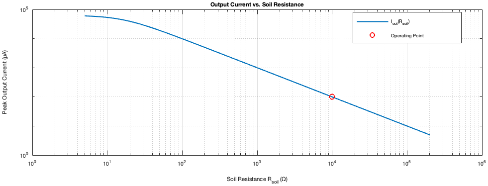
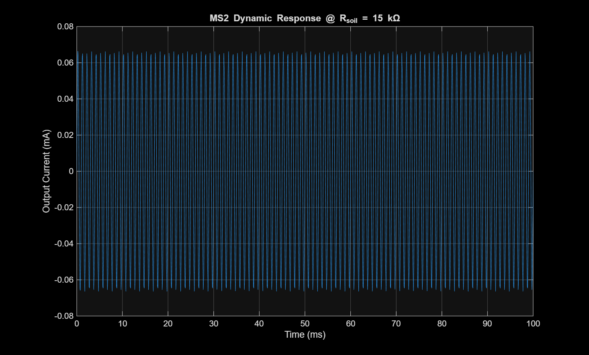
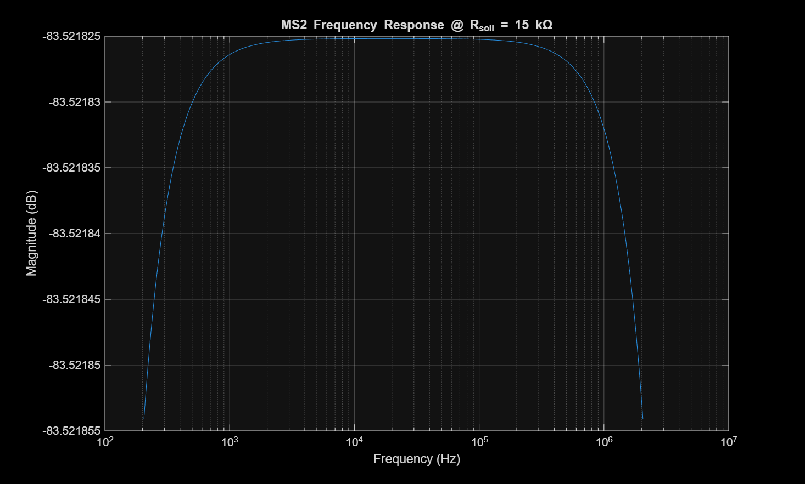
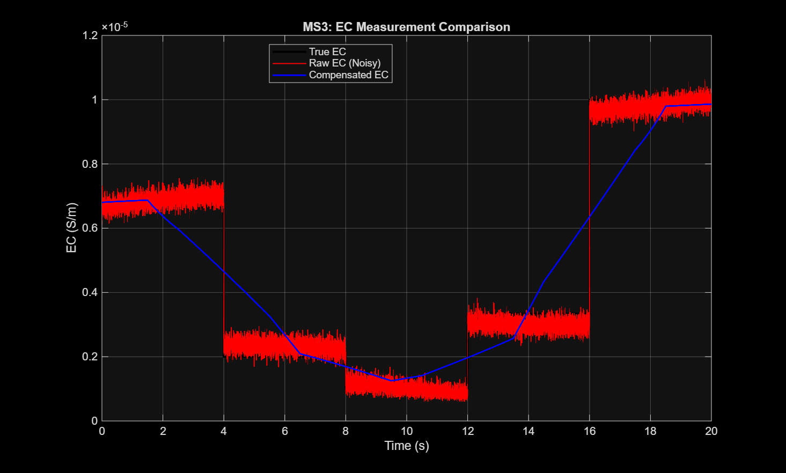

# Soil Salinity (EC) Sensor System

[](LICENSE)
[](https://www.mathworks.com/)
[](https://github.com/andrew-abdelmalak/soil-salinity-ec-sensor/actions/workflows/lint.yml)

Design, mathematical modeling, performance optimization, signal processing, and commercial benchmarking of a two-electrode soil electrical conductivity (EC) sensor for precision agriculture applications.

---

## Table of Contents

1. [Project Overview](#project-overview)
2. [Key Results](#key-results)
3. [Circuit Model](#circuit-model)
4. [Repository Structure](#repository-structure)
5. [Getting Started](#getting-started)
6. [Authors](#authors)
7. [Acknowledgments](#acknowledgments)
8. [References](#references)
9. [License](#license)

---

## Project Overview

Soil salinity is measured via electrical conductivity (EC). This project models a two-electrode impedance-based sensing circuit as a second-order RLC system driven by an AC excitation signal, derives and validates the sensor transfer function, optimizes sensitivity through cell-constant reduction, and develops a dual-window compensation scheme for real-world measurement noise and slow drift.

| Stage | Focus |
|-------|-------|
| Baseline characterization | Parameter setup, static calibration, linearity, step/frequency response |
| Enhanced modeling | Revised circuit model, Bode analysis, performance validation against specifications |
| Signal compensation | Noise injection, drift modeling, moving-average compensation filter, error metrics |

---

## Key Results

### Performance Comparison: Baseline vs. Optimized Design

| Metric | Baseline | Optimized | Factor |
|--------|----------|-----------|--------|
| Cell Constant K_cell [cm⁻¹] | 1.0 | 0.1 | 10× ↓ |
| Double-Layer Capacitance C_dl [µF] | 10 | 20 | 2× ↑ |
| Soil Resistance R_soil [kΩ] | 150 | 15 | 10× ↓ |
| RC Time Constant τ [s] | 1.5 | 0.3 | 5× faster |
| Settling Time | ≈6 s | <100 ms | >60× faster |
| Peak Current I_peak (fresh) [µA] | 6.67 | 66.7 | 10× ↑ |
| Natural Frequency f_n [kHz] | 29.06 | 20.5 | — |
| Bandwidth | >1 MHz | >2 MHz | ~2× |

### Noise Compensation Performance

| Metric | Raw | Compensated |
|--------|-----|-------------|
| RMSE | 3.12 × 10⁻⁷ | 1.25 × 10⁻⁶ |
| RMSE (% of mean EC) | 6.78% | 27.25% |
| Max Absolute Error | 9.77 × 10⁻⁷ | 3.65 × 10⁻⁶ |
| Mean Bias | 3.66 × 10⁻⁹ | −4.09 × 10⁻⁹ |

### Commercial Sensor Benchmarking (Weighted Decision Matrix)

| Criterion | Wt. (%) | Atlas K 1.0 | Vernier | METER 5TE | **Ours** |
|-----------|---------|-------------|---------|-----------|----------|
| Range Coverage | 20 | 10 | 6 | 7 | **10** |
| Accuracy | 25 | 10 | 9 | 6 | **8** |
| Response Time | 15 | 7 | 5 | 10 | **10** |
| Environ. Suit. | 10 | 8 | 6 | 10 | **7** |
| Interference Imm. | 10 | 9 | 8 | 7 | **8** |
| Cost | 5 | 8 | 7 | 5 | **10** |
| Maintenance | 5 | 9 | 8 | 9 | **7** |
| **Total Score** | 100 | **9.00** | 7.05 | 7.80 | **8.75** |

### Simulation Results

<table>
<tr>
<td><br><em>Static calibration: peak output current vs. soil resistance (log-log), showing inverse I ∝ 1/R relationship.</em></td>
<td><br><em>Optimized dynamic response at R_soil = 15 kΩ: fast settling (&lt;0.2 ms) with stable 1 kHz sinusoidal output.</em></td>
</tr>
<tr>
<td><br><em>Bode plot: flat passband from ~10 Hz to natural frequency; −3 dB bandwidth exceeding 1 MHz.</em></td>
<td><br><em>EC estimation comparison: raw, measured (noisy), and compensated signals over a 20 s trajectory.</em></td>
</tr>
</table>

---

## Circuit Model

The sensor is modelled as a series RLC impedance driven by an AC voltage source at frequency $f_{ex} = 1\,\text{kHz}$:

$$Y(s) = \frac{C_{dl}\,s}{L_{coil}\,C_{dl}\,s^2 + R_{soil}\,C_{dl}\,s + 1}$$

The output current amplitude is:

$$I_{out}(R_{soil}) = |Y(j\omega)| \cdot V_{peak}$$

Design parameters:

| Parameter | Symbol | Value |
|-----------|--------|-------|
| Lead inductance | $L_{coil}$ | 3 µH |
| Probe double-layer capacitance | $C_{dl}$ | 10–20 µF |
| Excitation frequency | $f_{ex}$ | 1 kHz |
| Soil resistance range | $R_{soil}$ | 5 Ω – 200 kΩ |
| Excitation voltage | $V_{peak}$ | 1 V |

---

## Repository Structure

```
soil-salinity-ec-sensor/
├── docs/
│   └── Soil_EC_Sensor_Design.pdf       # Full project report
├── matlab/
│   ├── setup_parameters.m              # Baseline sensor parameters
│   ├── setup_parameters_v2.m           # Enhanced model parameters
│   ├── parameter_validation.m          # Parameter validation & calibration
│   ├── parameter_validation_v2.m       # Enhanced parameter validation
│   ├── performance_analysis.m          # Static/dynamic performance
│   ├── performance_analysis_v2.m       # Enhanced performance analysis
│   ├── frequency_response.m            # Bode plot and -3 dB bandwidth
│   ├── step_response_analysis.m        # Step response (fresh/salty water)
│   ├── step_response_analysis_v2.m     # Enhanced step response
│   ├── sensitivity_analysis.m          # Parametric sensitivity study
│   ├── ode_function.m                  # ODE right-hand side for time integration
│   ├── noise_compensation_main.m       # Noise + drift compensation pipeline
│   ├── generate_signals.m              # Signal generation for compensation scenarios
│   ├── add_noise_and_drift.m           # Noise and drift injection
│   ├── compensation_filter.m           # Moving-average compensation filter
│   ├── error_metrics.m                 # RMSE / peak-error quantification
│   ├── ec_sensor_model.slx             # Simulink circuit model
│   ├── validated_parameters.mat        # Saved validated parameter set
│   ├── results/
│   │   ├── data/                       # Simulation output datasets (CSV, MAT)
│   │   ├── figures/                    # Exported plots (PNG, JPG)
│   │   └── reports/                    # Analysis reports and correction notes (MD)
│   └── tools/
│       └── *.py                        # Code-generation and patch helpers
├── .gitignore
├── LICENSE
└── README.md
```

---

## Getting Started

### Prerequisites

- MATLAB R2021a or later
- Simulink (for `ec_sensor_model.slx`)

### Recommended Execution Order

**Baseline characterization:**
```matlab
run('matlab/setup_parameters.m')
run('matlab/parameter_validation.m')
run('matlab/performance_analysis.m')
run('matlab/step_response_analysis.m')
run('matlab/frequency_response.m')
run('matlab/sensitivity_analysis.m')
```

**Enhanced model:**
```matlab
run('matlab/setup_parameters_v2.m')
run('matlab/parameter_validation_v2.m')
run('matlab/performance_analysis_v2.m')
run('matlab/step_response_analysis_v2.m')
```

**Noise and drift compensation:**
```matlab
run('matlab/noise_compensation_main.m')
```

Outputs (CSV datasets, figures, summary reports) are written to `matlab/results/data/`, `matlab/results/figures/`, and `matlab/results/reports/`.

The full project report is available in [`docs/Soil_EC_Sensor_Design.pdf`](docs/Soil_EC_Sensor_Design.pdf).

---

## Authors

| Name | Affiliation |
|------|-------------|
| **Andrew Khalil** | Mechatronics Engineering, GUC |
| **Daniel George** | Mechatronics Engineering, GUC |
| **David Louis** | Mechatronics Engineering, GUC |
| **Samir Sameh** | Mechatronics Engineering, GUC |
| **Youssef Youssry** | Mechatronics Engineering, GUC |

---

## Acknowledgments

This project was developed as part of the Mechatronics Engineering program at the German University in Cairo (GUC).

---

## References

[1] Atlas Scientific, "Conductivity Probe K 1.0 Datasheet," 2023. [Online]. Available: https://atlas-scientific.com/probes/conductivity-probe-k-1-0/

[2] Vernier Software & Technology, "Conductivity Probe User Manual (CON-BTA)," 2025. [Online]. Available: https://www.vernier.com/manuals/con-bta/

[3] METER Group, Inc., "5TE Water Content, EC and Temperature Sensors Manual," 2018. [Online]. Available: https://www.misure.net/sites/default/files/pdf/20435_5TE_Manual_Web.pdf

[4] J. D. Rhoades, F. Chanduvi, and S. Lesch, "Soil Salinity Assessment: Methods and Interpretation of Electrical Conductivity Measurements," FAO Irrigation and Drainage Paper 57, Rome, Italy, 1999.

[5] R. S. Ayers and D. W. Westcot, "Water Quality for Agriculture," FAO Irrigation and Drainage Paper 29, Rev. 1, Rome, Italy, 1985.

[6] D. L. Corwin and S. M. Lesch, "Apparent soil electrical conductivity measurements in agriculture," *Computers and Electronics in Agriculture*, vol. 46, no. 1–3, pp. 11–43, 2005.

[7] J. Fraden, *Handbook of Modern Sensors: Physics, Designs, and Applications*, 5th ed. Cham, Switzerland: Springer, 2016.

[8] K. Ogata, *Modern Control Engineering*, 5th ed. Upper Saddle River, NJ, USA: Prentice Hall, 2010.

[9] M. Hayashi, "Temperature-electrical conductivity relation of water for environmental monitoring and geophysical data inversion," *Environmental Monitoring and Assessment*, vol. 96, no. 1–3, pp. 119–128, 2004.

---

## License

Released under the [MIT License](LICENSE). © 2026 Andrew Abdelmalak.
